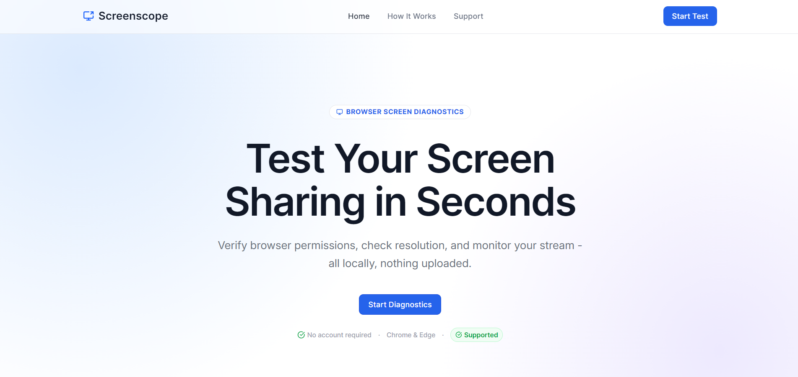
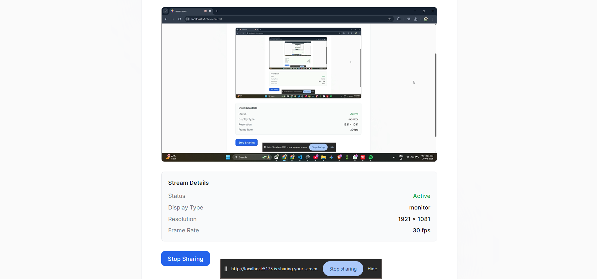
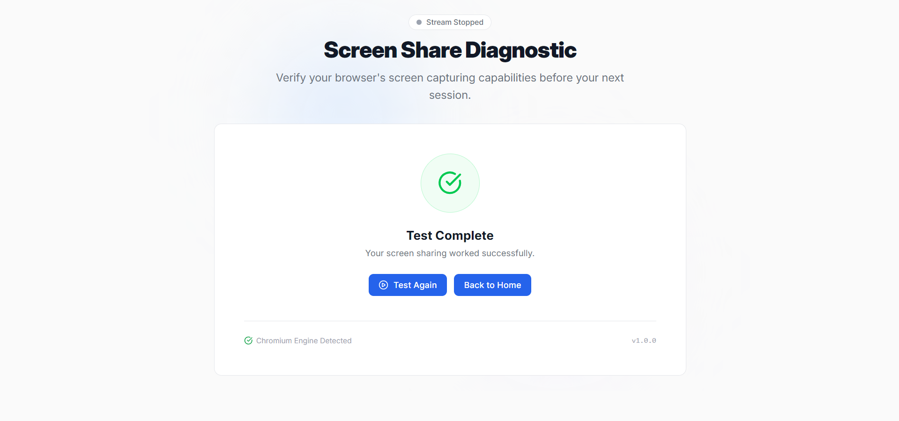
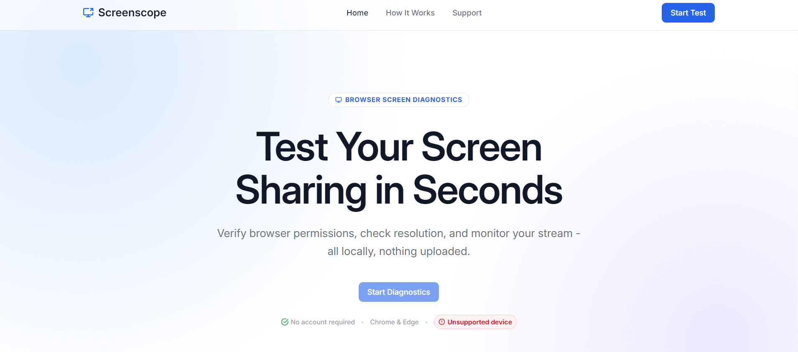

# Screenscope - Browser Screen Share Diagnostic

Screenscope is a small, focused tool that helps you verify whether your browser supports screen sharing before you jump into a meeting or recording session. It runs entirely in your browser - nothing is uploaded, nothing is recorded.

Built with React, TypeScript, Tailwind CSS, and React Router.

---

## What It Does

You click a button, your browser asks for screen sharing permission, and the app shows you a live preview of what your screen looks like along with some useful metadata - resolution, frame rate, and display surface type. When you stop sharing, the app cleans up everything properly and lets you retry if needed.

It also handles all the edge cases: what if you cancel the picker? What if permission is denied? What if your browser doesn't support it at all? Each situation gets its own clear UI state instead of a generic error message.

---

## Features

- Permission request using native `getDisplayMedia` - no third-party libraries
- Handles every possible state: Idle, Requesting, Granted, Cancelled, Denied, Error, Stopped, Unsupported
- Live local preview via `<video srcObject>`
- Metadata display - resolution, frame rate, display surface
- Automatic stream termination detection via `track.onended`
- Clean retry flow without stream reuse or memory leaks
- Proper cleanup on manual stop, browser stop, and component unmount
- Mobile-aware layout with stable viewport height
- Active nav link highlighting
- 404 page
- Support page with troubleshooting guidance

---

## Tech Stack

- React + Vite
- TypeScript
- Tailwind CSS v4
- React Router DOM
- Native Web APIs only (`getDisplayMedia`, `MediaStreamTrack`)

---

## Getting Started

**Clone the repo**

```bash
git clone https://github.com/iamayushkarma/screenscope
cd <project-folder>
```

**Install dependencies**

```bash
npm install
```

**Start the dev server**

```bash
npm run dev
```

Then open `http://localhost:5173` in Chrome or Edge.

**Build for production**

```bash
npm run build
```

---

## How Screen Sharing Works Under the Hood

1. Capability check

Before anything happens, the app checks whether `navigator.mediaDevices?.getDisplayMedia` exists. If it doesn't, the user sees an unsupported state immediately - no broken permission dialogs.

2. Permission request

When the user clicks the button:

```ts
navigator.mediaDevices.getDisplayMedia({
  video: { frameRate: { ideal: 30 } },
  audio: false,
});
```

The browser shows its native screen picker. Depending on what happens, the app transitions to one of: Granted, Cancelled, Denied, or Error.

3. Live preview and metadata

Once granted, the stream is attached directly to a `<video>` element via `srcObject`. Metadata is pulled from:

```ts
track.getSettings();
```

This gives us width, height, frame rate, and display surface (tab / window / entire screen). Nothing is stored or sent anywhere.

4. Lifecycle detection

The app listens for the user stopping the share from the browser's own UI:

```ts
track.onended = () => { ... }
```

When that fires, tracks are stopped, references are cleared, and the UI moves to the Stopped state.

5. Cleanup

Every exit path - manual stop button, browser stop, retry, component unmount - runs through the same cleanup function:

```ts
stream.getTracks().forEach((track) => track.stop());
```

This prevents stale streams, memory leaks, and the browser's "tab is still sharing" indicator from getting stuck.

---

## Project Structure

```
screenscope/
├── public/
│   └── vite.svg
├── src/
│   ├── assets/
│   │   └── react.svg
│   ├── components/
│   │   ├── commen/
│   │   │   ├── DeskTopNavbar.tsx
│   │   │   ├── Footer.tsx
│   │   │   ├── MobileNavMenu.tsx
│   │   │   └── Navbar.tsx
│   │   ├── sections/
│   │   │   ├── HeroSection.tsx
│   │   │   └── HowItWorks.tsx
│   │   └── ui/
│   │       ├── Button.tsx
│   │       └── ShimmerButton.tsx
│   ├── hooks/
│   │   └── useScreenShare.ts
│   ├── layout/
│   │   └── MainLayout.tsx
│   ├── pages/
│   │   ├── HomePage.tsx
│   │   ├── PageNotFound.tsx
│   │   ├── ScreenTest.tsx
│   │   └── Support.tsx
│   ├── screenshots/
│   │   ├── granted.png
│   │   ├── home.png
│   │   ├── stopped.png
│   │   └── unsupported.png
│   ├── types/
│   │   ├── HowItWorkCard.types.ts
│   │   ├── navbar.types.ts
│   │   └── screen.types.ts
│   ├── utils/
│   ├── App.tsx
│   ├── index.css
│   └── main.tsx
├── .gitignore
├── README.md
├── eslint.config.js
├── index.html
├── package-lock.json
├── package.json
├── tailwind.config.js
├── tsconfig.app.json
├── tsconfig.json
├── tsconfig.node.json
└── vite.config.ts
```

---

## Browser Support

Works on Chromium-based browsers - Chrome and Edge. Firefox has partial support depending on version. Safari and most mobile browsers do not support `getDisplayMedia` at all, which is why the app checks for support upfront and shows a clear message instead of failing silently.

Screen sharing also requires a secure context, so in production the app needs to be served over HTTPS.

---

## Privacy

- No video is recorded
- No screen data leaves your device
- No account required
- No analytics or tracking
- Everything runs locally in your browser

---

## Screenshots

**Home**


**Stream Active (Granted)**


**Stream Stopped**


**Unsupported Browser**


---

## Contact

ayushkarma.dev@gmail.com

---

## Live Demo

[screenscope.vercel.app](https://screenscope.vercel.app/)
